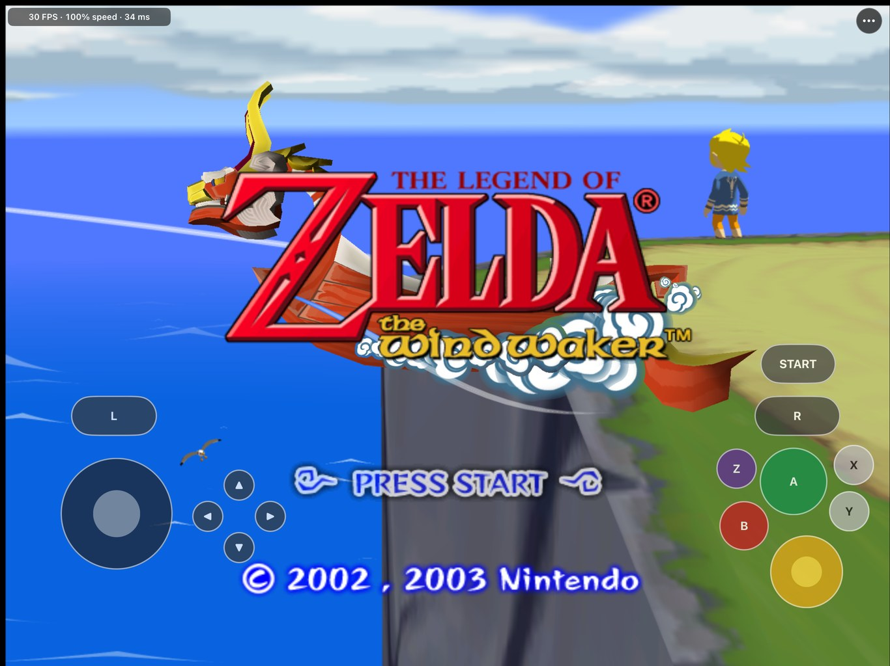
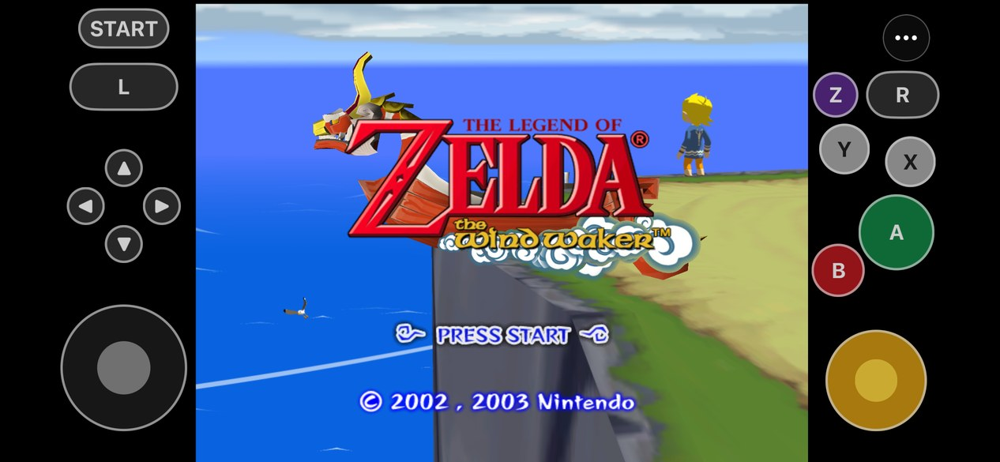

# BlueWake

  <strong>The Legend of Zelda: The Wind Waker, running natively on iPhone and iPad.</strong> 
  A static recompilation of the GameCube original, with Metal rendering, touch controls, controllers and mods.

  
  
  
  
  
  
  
  

> [!IMPORTANT]
> **Bring your own disc.** BlueWake needs your own legally obtained copy of *The Wind Waker* for
> GameCube, USA version (`GZLE01`, revision 0). This repository and the app contain no disc image,
> game assets or saves.
>
> **Source preview.** There is no download yet: you build BlueWake on a Mac from your disc and install
> it on your own device. See [Getting started](#getting-started).
>
> **AI disclosure:** BlueWake is developed with substantial AI assistance for code, testing,
> documentation and debugging. The status log records what has actually been checked, and on what.

**Questions or bugs?** Join the [Discord](https://discord.gg/xwHfUD2bxW) or
[open an issue](https://github.com/chrissotraidis/bluewake/issues).

## What is BlueWake?

BlueWake translates the game's PowerPC code, the main executable and all 415 of its modules, into
native arm64 code ahead of time, on your Mac. The app runs that code with a compatibility runtime for
the GameCube's hardware: memory and timing, disc and memory card, controllers, DSP audio, and graphics
through Metal. Nothing is compiled on the device while you play, so it needs no JIT; the few rare instructions the translator does not handle fall back to an interpreter.

The runtime is derived from [Dolphin](https://dolphin-emu.org/) and keeps an interpreter fallback, so
BlueWake is a static recompilation with a hardware compatibility layer, not an "emulation-free" rewrite.

## What works

- **The game, start to finish as far as tested:** the opening and prologue, Outset Island, sailing the
  Great Sea, Windfall, a late-game Hyrule save, menus, and saving and reloading through the game's own
  memory card
- **30 FPS at full speed** on an iPad Pro (M2), the game's native frame rate, with stereo audio
- **Touch controls** with a layout editor, opacity and size settings
- **Game controllers and keyboards**, with camera inversion and button remapping
- **The ⋯ menu:** FPS display, render resolution up to 4×, texture filtering up to 16× anisotropic,
  aspect ratio, mods, save backup and restore, and Report a Problem
- **Mods:** 16:9 widescreen, Dolphin-format HD texture packs and
  [Better Wind Waker](https://github.com/WideBoner/betterww)

Later dungeons and boss fights are still largely untested. If you find a problem there, please
[report it](#getting-help).

## Performance

| Device | Result |
| --- | --- |
| iPad Pro 12.9" (M2) | Steady 30 FPS at full speed; a 44-minute session had 14 seconds below 29 FPS, all brief dips at area loads |
| iPhone 14 (A15) | 30 FPS in most play; dips to about 25-27 FPS in the busiest scenes and the title-screen flyover |
| Older devices | A13 or newer is required; slower chips have not been measured |

These are the developer's build, which uses an extra optimization profile for the game's own code. A
build you make with the Builder does not have it yet and is slower: at the Outset Island pier on the iPad
Pro (M2) it runs at about 27.5 FPS instead of 30. Closing that gap is the top item before the first
release.

The limit on slower chips is CPU time for the game's own code, not the GPU, so lowering the render
resolution does not help much there. Performance on smaller devices is active work.

  

## Getting started

You need:

- a Mac with Apple silicon, Xcode, CMake and Ninja, and about 5 GB of free disk space
- your `GZLE01` revision 0 disc image
- an A13 or newer iPhone or iPad on iOS/iPadOS 17 or later, with Developer Mode on
- an Apple ID for signing (a free one works; its apps expire after seven days)

One command builds your own app from a fresh checkout:

~~~bash
scripts/builder/build.sh "/path/to/The Legend Of Zelda The Wind Waker.iso" --ipa build/BlueWake.ipa
~~~

It fetches the pinned runtime and translator, checks your disc, translates the game from it, compiles
it for iOS and writes an unsigned IPA. Install that with Sideloadly, AltStore, SideStore or Xcode, then
copy the same disc image to your device (Finder › your device › Files › BlueWake); BlueWake imports it on
first launch. The first compile is long (about 1.5 hours on an M3 Max, longer on smaller Macs) and resumes if interrupted; run it with
`--source-only` first to check your tools and disc in a few minutes.

**The IPA you build contains code translated from your disc: it is yours alone. Never share or upload it.**

Step by step, with updating and troubleshooting: [Build your own BlueWake](docs/BUILD_YOUR_OWN.md).
Signing with your own identity and other options: [docs/status/DEVICE_BUILD.md](docs/status/DEVICE_BUILD.md).

## Mods

Open **⋯ › Mods**. Each mod applies the next time BlueWake starts and never changes your saves.

| Mod | What it does | How to add it |
| --- | --- | --- |
| **Widescreen 16:9** | A wider view with the HUD placed for 16:9 | Built in; turn it on |
| **HD Texture Pack** | Replaces the game's textures, for example with Hypatia's HD pack | **Install Texture Pack…** and pick the pack's folder in Files |
| **Better Wind Waker** | Wind Waker HD's quality-of-life changes: Swift Sail, instant text and more | Patch your disc on a Mac, then **Install Better Wind Waker…** |

Code mods cannot be applied to a statically recompiled game at runtime, so they are translated and built
into the app. Details are in [docs/MODS.md](docs/MODS.md).

## Your saves and game data

- Saves live in the app's memory card file, **On My iPad › BlueWake › BlueWake › GZLE01.card** in Files.
- **⋯ › Game Data & Saves › Back Up Saves…** exports a copy; **Restore Saves…** brings one back and
  keeps a copy of your current saves in a Backups folder first.
- Install updates over the existing app. Deleting BlueWake deletes its saves, so back them up first.
- **Remove Disc Image…** frees the space used by the disc and the files made from it. Saves, mods and
  settings stay.

## Known issues

- **Loading hitches.** Changing areas costs a brief stall, the original game's own load work.
- **First visits to new areas.** A bundled cache covers the areas tested so far; elsewhere, some
  objects may take a moment to appear the first time.
- **Busy scenes on iPhone** drop below 30 FPS on chips older than the M-series iPads.

## Getting help

- **Discord:** [discord.gg/xwHfUD2bxW](https://discord.gg/xwHfUD2bxW) for questions, testing and updates
- **Bug reports:** **⋯ › Help & Feedback › Report a Problem on GitHub** opens a prefilled issue. Say
  which device, where in the game it happened and what you saw, and attach the session log
  (**Share Session Log**, same menu). Please do not attach game files or disc images.

## Frequently asked questions

### Can I download it?

No. The app runs code translated from the game, so it cannot be shared. Everyone builds their own from
their own disc, on a Mac, with one command: see [Build your own BlueWake](docs/BUILD_YOUR_OWN.md).

### Why does it need my disc?

The game's code is translated from your disc during the build, and the game's graphics, sound and
world data are read from your disc on the device. Neither is included here.

### Which version of the game works?

Only the GameCube USA release, `GZLE01` revision 0. The build checks the disc and refuses others. The
Wii U *Wind Waker HD* is a different game and is not supported.

### Is this an emulator?

Not in the usual sense. The game's code is translated to native arm64 ahead of time and there is no
JIT; only a few rare instructions fall back to an interpreter. The hardware around the CPU (graphics, audio, memory
card, timing) comes from a Dolphin-derived runtime.

### Why 30 FPS?

That is the game's own frame rate on the GameCube. BlueWake runs it at full speed; it does not run
faster.

### Does it work on iPhone?

Yes, on an A13 or newer. The touch controls sit in the black bars beside the picture. The busiest scenes
dip below 30 FPS on an iPhone 14; see [Performance](#performance).

### Do controllers work?

Yes. Controllers that iOS supports work, with camera inversion and button remapping under
**⋯ › Controller**, and the game's rumble is passed to the controller.

### Will updates keep my saves?

Yes, as long as you install over the existing app. Use **Back Up Saves…** before anything else, and
never delete the app to update it.

### Can I use my Dolphin saves?

Yes. Export the save from Dolphin (Tools, Memory Card Manager, or the `.gci` file in its GC folder), copy
it to your device, then open **⋯ › Game Data & Saves › Import Dolphin Save…**. Pick the quest log you want
and the BlueWake slot to put it in; your current saves are backed up first. USA saves only.

## Documentation

- [Current status](docs/status/CURRENT.md): the engineering log, newest first
- [Build your own BlueWake](docs/BUILD_YOUR_OWN.md): the player's guide
- [The Builder](docs/BUILDER.md): how the build works, and reusing it for other ports
- [Device build](docs/status/DEVICE_BUILD.md): signing, installing and build options
- [Mods](docs/MODS.md): the three mods and how code mods are built
- [History](docs/HISTORY.md): the project's earlier README, from macOS prototype to iPad
- [Porting history](docs/PORTING_HISTORY.md) and [legal and provenance](docs/research/LEGAL_AND_PROVENANCE.md)

## Credits

- [Dolphin](https://dolphin-emu.org/): the compatibility runtime, DSP audio and texture-pack format
  come from it, and its GZLE01 game settings supply the widescreen code
- [RecompCore](https://github.com/chrissotraidis/RecompCore) and
  [DolRecomp](https://github.com/chrissotraidis/DolRecomp), forked for BlueWake, with the Aurora
  renderer and Dawn
- [zeldaret/tww](https://github.com/zeldaret/tww), the Wind Waker decompilation, for research
- [Better Wind Waker](https://github.com/WideBoner/betterww) by WideBoner
- HD texture pack authors, including
  [Hypatia](https://forums.dolphin-emu.org/Thread-hypatia-s-tloz-the-wind-waker-hd-pack-v2-0001a)
- SunPad, whose touch control overlay BlueWake adapts

## License and legal

BlueWake is licensed under the [GNU GPL, version 3 or later](LICENSE), the license its Dolphin-derived
runtime and SunPad-derived touch controls allow together. See
[RIGHTS_AND_LICENSES.md](RIGHTS_AND_LICENSES.md) for the details and for game content.

BlueWake is an independent fan project, not affiliated with or endorsed by Nintendo. *The Legend of
Zelda*, *The Wind Waker* and GameCube are trademarks of Nintendo. You need your own legally obtained
disc and are responsible for following the laws that apply to it.
